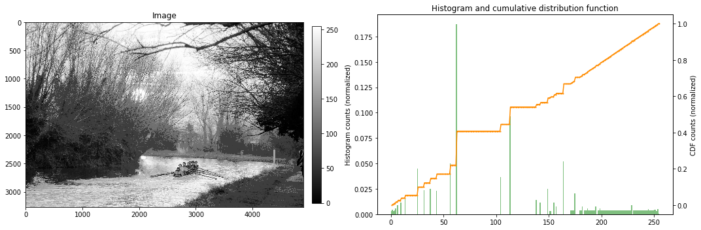

```python
%pylab inline
import matplotlib.pyplot as plt 
import numpy as np
import os
import cv2
```

    Populating the interactive namespace from numpy and matplotlib


# **Solutions to exercises in course "Image and Video Processing" by Prof. Guillermo Sapiro, Duke University.**

### Week 3 outline:
* Histogram equalization
* Median filter 
* Non-local means algorithm
* Noise and averaging
* Color edge detection

# 1. Histogram equalization

**TASK**: Implement a histogram equalization function. 


* Histogram equalization aims at creation of an image with equally distributed brightness levels over the whole brightness scale. It enhances contrast for brightness values close to histogram maxima, and decreases contrast near minima.
* The goal is to find a monotonic pixel brightness transformation such that the desired output histogram is uniform over the whole output brightness scale.

* It turns out that the  pixel brightness transformation that satisfies this requirement is the **cumulative histogram distribution of the original image multiplied by the max value of the grey level**.

$g_{i,j} = \textrm{floor}((L-1)\cdot\sum_{n=0}^{f_{i,j}}􏰍p_n),$

where 

* $f_{i,j}$ are the grey values of the original image at $(i,j)$ pixel coordinates
* $g_{i,j}$ are the grey values of the transformed image at $(i,j)$ pixel coordinates
* $L$ is the number of grey levels in the original image (e.g. L=256 for an 8 bit image)
* $p$ is the normalized histogram of the original image $f$ with a bin $p_n$ for each possible intensity in $f$: 

$p_n = \frac{\textrm{number of pixels with intensity n}}{\textrm{total number of pixels}}, n = 0, 1, ..., L − 1$

* In this case, the equalized histogram of $g$ approximately corresponds to the uniform probability density function whose function value is a constant (approximately because of the discrete nature of the pixel values).

 ### 1.0 Read an image and convert it to the grey scale


```python
image = plt.imread('river.jpg')
plt.figure(figsize=(9,9))
plt.title('original RGB image')
plt.imshow(image)
image.dtype
```


    dtype('uint8')


```python
def rgb2gray(rgb_image):
    """
    a function converting grey to rgb
    """
    image_8bit = np.round(np.sum(rgb_image * np.array([0.114, 0.587, 0.299]), axis=-1)).astype('uint8')
    plt.figure(figsize=(9,9))
    plt.imshow(image_8bit , cmap='gray')
    plt.title('8 bit grayscale image')
    return image_8bit

gray_image = rgb2gray(image)
```


> Check the number of unique grey levels


```python
np.unique(gray_image).shape
```


    (256,)


### 1.1 Compute a histogram of the original image


```python
gray_levels = 256
bin_counts, _, _ = plt.hist(gray_image.ravel(), bins=gray_levels)
plt.title("histogram of the original image")
```


    Text(0.5, 1.0, 'histogram of the original image')


### 1.2 Compute its  cumulative histogram


```python
#compute a cumulative_histogram of the original image
cumulative_histogram = np.array([sum(bin_counts[:i+1]) for i in range(len(bin_counts))])

plt.plot(cumulative_histogram)
plt.title('cumulative_histogram')
plt.show()
```


### 1.3 Compute a transformation function to map the pixel values


```python
# note that the min value is subtracted (in the nominator) and it's also scaled by its maximum value (in the denominator) to have the same grey level range of the original image
transformation_function =  (gray_levels-1) * (cumulative_histogram - cumulative_histogram.min())  / (cumulative_histogram.max() - cumulative_histogram.min())

plt.plot(transformation_function)
plt.title('transformation_function')
plt.show()
```


### 1.4 Obtain an equalized image by mapping the old pixel vales into new ones using the transformation function.


```python
image_equalized_raveled = transformation_function[gray_image.ravel()]

bin_counts_equalized, _,_ = plt.hist(image_equalized_raveled, bins=256)
plt.title('equalized histogram')
print(image_equalized_raveled.shape)
```

    (15991970,)


Reshape the equalized image and plot it.


```python
gray_image_equalized = np.reshape(image_equalized_raveled, gray_image.shape)

fig, axs = plt.subplots(1, 2, figsize=(15,5))
ax1, ax2 = axs
im1=ax1.imshow(gray_image, cmap='gray')
ax1.set_title('original')
im2=ax2.imshow(gray_image_equalized, cmap='gray')
ax2.set_title('equalized')
plt.colorbar(im1,ax=ax1,fraction=0.035, pad=0.03)
plt.colorbar(im2,ax=ax2,fraction=0.035, pad=0.03)
```


    <matplotlib.colorbar.Colorbar at 0x1215b35f8>


### 1.4 Histogram equalization in one step

To equalize the histogram of an image in a single step, use ```equalize_histogram```  function defined below. 


```python
def equalize_histogram(im, gray_levels):
    
    """
    Computes an equalized histogram of the image and transforms it accordingly
    Plots the original image and its histogram and cimulative distribution function BEFORE the equalization
    --
    input
    --
    im : array of floats
        input image to compute the equalized histogram of
    gray_levels: int
        number of gray levels in the image
    --
    return
    --
    im_equalized: array of floats
        original image after the histogram equalization
    
    """
    
    fig, axs = plt.subplots(1, 2, figsize=(15,5))
    ax1, ax2 = axs
    im1 = ax1.imshow(im, cmap='gray')
    ax1.set_title('Image')
    plt.colorbar(im1,ax=ax1,fraction=0.03, pad=0.03)
    #
    # plot a histogram of the image
    bin_counts, bin_edges, _ = ax2.hist(im.ravel(), bins=gray_levels, density=True, alpha = 0.5, color = "green", label = "Histogram")
    # 
    # compute a cumulative_histogram 
    cumulative_histogram = np.array([sum(bin_counts[:i+1]) for i in range(len(bin_counts))])
    #
    # compute the transformation function
    # note that the min value is subtracted (in the nominator) and it's also scaled by its maximum value (in the denominator) to have the same grey level range of the original image
    transformation_function =  (gray_levels-1) * (cumulative_histogram - cumulative_histogram.min())  / (cumulative_histogram.max() - cumulative_histogram.min())
    #
    # plot the transformation function
    plt.ylabel("Histogram counts (normalized)")
    ax2.twinx()
    plt.plot(bin_edges[1:], transformation_function/max(transformation_function), color='darkorange', marker='o', linestyle='-', markersize = 1,)
    plt.ylabel("CDF counts (normalized)")
    plt.title("Histogram and cumulative distribution function")
    fig.tight_layout()
    
    #
    # apply the transformation function
    im_eq_raveled = transformation_function[im.astype(int).ravel()]
    #
    # reshape the image 
    im_equalized = np.reshape(im_eq_raveled, gray_image.shape)
    
    return im_equalized
```

> Equalize the histogram, plot the original image and its histogram and cumulative distribution function before the equalization


```python
gray_image_eq = equalize_histogram(gray_image, gray_levels=256)
```


> To visualise the image, its histogram and cumulative distribution function after the equalization, apply the function again.


```python
gray_image_eq = equalize_histogram(gray_image_eq, gray_levels=256)
```


> Let's check what happens if we apply the equalization many times.


```python
gray_image_eq = equalize_histogram(gray_image_eq, gray_levels=256)
```


```python
gray_image_eq = equalize_histogram(gray_image_eq, gray_levels=256)
```


```python
gray_image_eq = equalize_histogram(gray_image_eq, gray_levels=256)
```


```python
gray_image_eq = equalize_histogram(gray_image_eq, gray_levels=256)
```


```python
gray_image_eq = equalize_histogram(gray_image_eq, gray_levels=256)
```


```python
gray_image_eq = equalize_histogram(gray_image_eq, gray_levels=256)
```


```python
gray_image_eq = equalize_histogram(gray_image_eq, gray_levels=256)
```


```python
gray_image_eq = equalize_histogram(gray_image_eq, gray_levels=256)
```





```python
np.unique(gray_image_eq).shape
```


    (99,)


> We are loosing the bit-depth of the image by applying the equalization many times.

# 2. Median filter 

**TASK** : Implement a median filter. Add different levels and types of noise to an image and experiment with different sizes of support for the median filter. 

The median filter replaces each pixel value with the median of its neighboring pixel values. For a given pixel, the filter takes all its neighboring pixels, sorts them, takes the one in the middle and replaces the current pixel values with the selected one. In case there is an even number of pixels in the neighbourhood, then the average value of the pixels in the middle is used. 

The median filter is very effective in removing salt-and-pepper noise. Any "cold" or "hot" pixel will most probably not be the median one and thus will be replace by one of its neighbouring pixels.  

The median filter is also effective in preserving the edges. This is because the median value used to replace pixels in the original image must actually belong to the image. Thus there will be no new unrealistic values created. In contrast, the mean filter constantly creates new pixel values, thus chaning the original appearance of the image and blurring the edges.

## Median filter and salt-and-pepper noise

 > Median filter is used to remove salt-and-pepper noise.
 
 > First add some salt-and-pepper noise to the original image


```python
import random

def salt_and_pepper(input_image = None, SNR = 0.5):
    #
    # make a copy of the input image
    noisy_image = np.copy(input_image)
    #
    # calculate total number of pixels in the input image
    npixels_total = input_image.shape[0] * input_image.shape[1]
    #
    # calculate number of noisy pixels
    npixels_noise = int(npixels_total * (1 - SNR))
    #
    # randomly choose  which pixels  will be noisy
    for i in range (npixels_noise):
        # generate random pixel coordinates
        random_x = np.random.randint(0,input_image.shape[0]) # Generate a random integer between 1 and h-1
        random_y = np.random.randint(0,input_image.shape[1]) # Generate a random integer between 1 and h-1
        #
        if random.random()<0.5:
            # salt
            noisy_image[random_x, random_y]=0
        else:
            # and pepper
            noisy_image[random_x, random_y]=255
    return noisy_image


noisy_image = salt_and_pepper(input_image = gray_image_equalized, SNR = 0.5)
```


```python
fig, axs = plt.subplots(1, 2, figsize=(15,5))
ax1, ax2 = axs
im1=ax1.imshow(gray_image_equalized, cmap='gray')
ax1.set_title('original')
im2=ax2.imshow(noisy_image, cmap='gray')
ax2.set_title('noisy')
plt.colorbar(im1,ax=ax1,fraction=0.035, pad=0.03)
plt.colorbar(im2,ax=ax2,fraction=0.035, pad=0.03)
```


    <matplotlib.colorbar.Colorbar at 0xbb17e7898>


> Now try different implementations of the median filter

## ndimage.median_filter


```python
from scipy import ndimage
noise_free_3x3 = ndimage.median_filter(noisy_image, size=3)
```


```python
fig, axs = plt.subplots(1, 2, figsize=(15,5))
ax1, ax2 = axs
im1=ax1.imshow(noisy_image, cmap='gray')
ax1.set_title('noisy, SNR = 50%')
im2=ax2.imshow(noise_free_3x3, cmap='gray')
ax2.set_title('filtered ndimage.median_filter, kernel = 3x3')
plt.colorbar(im1,ax=ax1,fraction=0.035, pad=0.03)
plt.colorbar(im2,ax=ax2,fraction=0.035, pad=0.03)
```


    <matplotlib.colorbar.Colorbar at 0xbb1c1e710>


##  3x3 kernel applied 4 times  vs. 7x7 kernel applied once

* Using 3x3 kernel once is not enough to remove all noise. 

**Solution**: 
* We can either use a larger kernel, let's say a 7x7 kernel (this will blur the image though, make it look "blotchy".)
* Or we can apply the 3x3 kernel several times (this will keep the image sharper).


```python
noise_free_3x3 = ndimage.median_filter(noise_free_3x3, size=3)
```


```python
fig, axs = plt.subplots(1, 2, figsize=(15,5))
ax1, ax2 = axs
im1=ax1.imshow(noisy_image, cmap='gray')
ax1.set_title('noisy, SNR = 50%')
im2=ax2.imshow(noise_free_3x3, cmap='gray')
ax2.set_title('filtered ndimage.median_filter, kernel = 3x3, 2x times')
plt.colorbar(im1,ax=ax1,fraction=0.035, pad=0.03)
plt.colorbar(im2,ax=ax2,fraction=0.035, pad=0.03)
```


    <matplotlib.colorbar.Colorbar at 0xbb15522e8>


```python
noise_free_3x3 = ndimage.median_filter(noise_free_3x3, size=3)
noise_free_3x3 = ndimage.median_filter(noise_free_3x3, size=3)
```


```python
fig, axs = plt.subplots(1, 2, figsize=(15,5))
ax1, ax2 = axs
im1=ax1.imshow(noisy_image, cmap='gray')
ax1.set_title('noisy, SNR = 50%')
im2=ax2.imshow(noise_free_3x3, cmap='gray')
ax2.set_title('filtered ndimage.median_filter, kernel = 3x3, 4x times')
plt.colorbar(im1,ax=ax1,fraction=0.035, pad=0.03)
plt.colorbar(im2,ax=ax2,fraction=0.035, pad=0.03)
```


    <matplotlib.colorbar.Colorbar at 0xbb19a45f8>


```python
noise_free_7x7 = ndimage.median_filter(noisy_image, size=3)
```


```python
fig, axs = plt.subplots(1, 2, figsize=(15,5))
ax1, ax2 = axs
im1=ax1.imshow(noisy_image, cmap='gray')
ax1.set_title('mnoisy')
im2=ax2.imshow(noise_free_7x7, cmap='gray')
ax2.set_title('filtered ndimage.median_filter, kernel = 7x7')
plt.colorbar(im1,ax=ax1,fraction=0.035, pad=0.03)
plt.colorbar(im2,ax=ax2,fraction=0.035, pad=0.03)
```


    <matplotlib.colorbar.Colorbar at 0xbb1e9a940>


## Zoom in to compare 3x3 kernel 4x times and 7x7 kernel applied once


```python
fig, axs = plt.subplots(1, 2, figsize=(15,5))
ax1, ax2 = axs
im1=ax1.imshow(noise_free_3x3[650:850,200:300], cmap='gray')
ax1.set_title('3x3 kernel 4 times')
im2=ax2.imshow(noise_free_7x7[650:850,200:300], cmap='gray')
ax2.set_title('7x7 kernel 1 time')
plt.colorbar(im1,ax=ax1,fraction=0.035, pad=0.03)
plt.colorbar(im2,ax=ax2,fraction=0.035, pad=0.03)
```


    <matplotlib.colorbar.Colorbar at 0x1d8d13aba8>


There is some loss of detail on the image on thr r.h.s. due to the larger size of the median filter's kernel.

#  3. Non-local means

The non-local means algorithm replaces the value of a pixel by an average of a selection of other pixels values: small patches centered on the other pixels are compared to the patch centered on the pixel of interest, and the average is performed only for pixels that have patches close to the current patch. As a result, this algorithm can restore well textures, that would be blurred by other denoising algorithm.

Add some Gaussian noise and rescale the intensity back to the original (0,255) range.


```python
import numpy as np
from  skimage.exposure import rescale_intensity

# generate Gaussian noise and add it to the image
mean = 0
std = 20
gaussian = np.random.normal(mean, std, (gray_image_equalized.shape[0],gray_image_equalized.shape[1]))
gray_image_gaussian_noise = gray_image_equalized + gaussian

# rescale intensity to (0,255) range
gray_image_gaussian_noise = rescale_intensity(gray_image_gaussian_noise, out_range=(0,255))
```


```python
# plot the result
fig, axs = plt.subplots(1, 2, figsize=(15,5))
ax1, ax2 = axs
im1=ax1.imshow(gray_image_equalized, cmap='gray')
ax1.set_title('original')
im2=ax2.imshow(gray_image_gaussian_noise, cmap='gray')
ax2.set_title('with Gaussian noise, std  = 20 ')
plt.colorbar(im1,ax=ax1,fraction=0.035, pad=0.03)
plt.colorbar(im2,ax=ax2,fraction=0.035, pad=0.03)
```


    <matplotlib.colorbar.Colorbar at 0xbb20b17f0>


### Small patch size = 10, fixed  patch distance = 10 and  sigma = 20


```python
from skimage.restoration import denoise_nl_means

gray_image_gaussian_nonlocal_10_10 = denoise_nl_means(gray_image_gaussian_noise, 
                                                patch_size=10, 
                 patch_distance=10, 
                 sigma = 20,
                 multichannel=False, 
                 fast_mode=True)


```


```python
# plot the result
fig, axs = plt.subplots(1, 2, figsize=(15,5))
ax1, ax2 = axs
im1=ax1.imshow(gray_image_gaussian_noise, cmap='gray')
ax1.set_title('Gaussian noise, std  = 20 ')
im2=ax2.imshow(gray_image_gaussian_nonlocal_10_10, cmap='gray')
ax2.set_title('non-local means, patch_size = 10, patch_distance = 10')
plt.colorbar(im1,ax=ax1,fraction=0.035, pad=0.03)
plt.colorbar(im2,ax=ax2,fraction=0.035, pad=0.03) 
```


    <matplotlib.colorbar.Colorbar at 0x125768da0>


