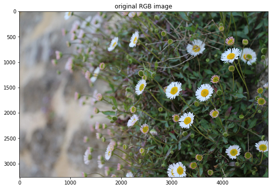
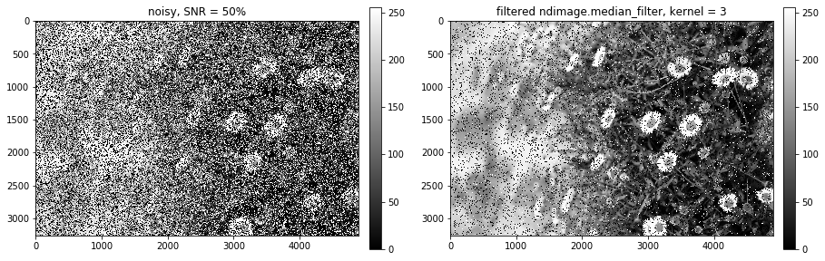
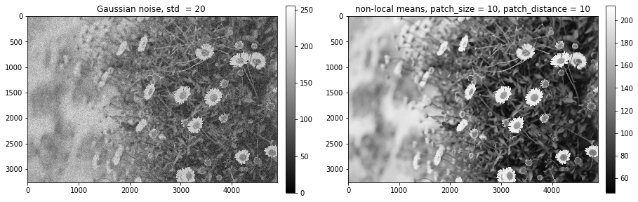
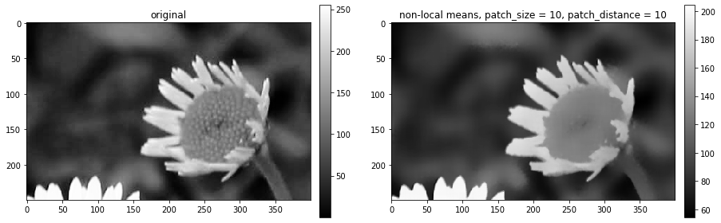

```python
%pylab inline
import matplotlib.pyplot as plt 
import numpy as np
import os
import cv2
```

    Populating the interactive namespace from numpy and matplotlib


    /Users/Pavel/anaconda3/lib/python3.6/site-packages/IPython/core/magics/pylab.py:160: UserWarning: pylab import has clobbered these variables: ['random']
    `%matplotlib` prevents importing * from pylab and numpy
      "\n`%matplotlib` prevents importing * from pylab and numpy"


# **Solutions to exercises in course "Image and Video Processing" by Prof. Guillermo Sapiro, Duke University.**

### Week 3 outline:
* Histogram equalization
* Median filter 
* Non-local means algorithm
* Noise and averaging
* Color edge detection

# 1. Histogram equalization

**TASK**: Implement a histogram equalization function. 


* Histogram equalization aims at creation of an image with equally distributed brightness levels over the whole brightness scale. It enhances contrast for brightness values close to histogram maxima, and decreases contrast near minima.
* The goal is to find a monotonic pixel brightness transformation such that the desired output histogram is uniform over the whole output brightness scale.

* It turns out that the  pixel brightness transformation that satisfies this requirement is the **cumulative histogram distribution of the original image multiplied by the max value of the grey level**.

$g_{i,j} = \textrm{floor}((L-1)\cdot\sum_{n=0}^{f_{i,j}}􏰍p_n),$

where 

* $f_{i,j}$ are the grey values of the original image at $(i,j)$ pixel coordinates
* $g_{i,j}$ are the grey values of the transformed image at $(i,j)$ pixel coordinates
* $L$ is the number of grey levels in the original image (e.g. L=256 for an 8 bit image)
* $p$ is the normalized histogram of the original image $f$ with a bin $p_n$ for each possible intensity in $f$: 

$p_n = \frac{\textrm{number of pixels with intensity n}}{\textrm{total number of pixels}}, n = 0, 1, ..., L − 1$

* In this case, the equalized histogram of $g$ approximately corresponds to the uniform probability density function whose function value is a constant (approximately because of the discrete nature of the pixel values).

 ### 1.0 Read an image and convert it to the grey scale


```python
image = plt.imread('ox2.jpg')
plt.figure(figsize=(9,9))
plt.title('original RGB image')
plt.imshow(image)
image.dtype
```


    dtype('uint8')





```python
image.shape
```


    (3265, 4898, 3)


```python
def rgb2gray(rgb_image):
    """
    a function converting grey to rgb
    """
    image_8bit = np.round(np.sum(rgb_image * np.array([0.114, 0.587, 0.299]), axis=-1)).astype('uint8')
    plt.figure(figsize=(9,9))
    plt.imshow(image_8bit , cmap='gray')
    plt.title('8 bit grayscale image')
    return image_8bit

gray_image = rgb2gray(image)
```


> Check the number of unique grey levels


```python
np.unique(gray_image).shape
```


    (248,)


### 1.1 Compute a histogram of the original image


```python
gray_levels = 256
bin_counts, bin_edges, _ = plt.hist(gray_image.ravel(), bins=gray_levels)
plt.title("histogram of the original image")
```


    Text(0.5, 1.0, 'histogram of the original image')


### 1.2 Compute its  cumulative histogram


```python
#compute a cumulative_histogram of the original image
cumulative_histogram = np.array([sum(bin_counts[:i+1]) for i in range(len(bin_counts))])

plt.plot(cumulative_histogram)
plt.title('cumulative_histogram')
plt.show()
```


### 1.3 Compute a transformation function to map the pixel values


```python
# note that the min value is subtracted (in the nominator) and it's also scaled by its maximum value (in the denominator) to have the same grey level range of the original image
transformation_function =  (gray_levels-1) * (cumulative_histogram - cumulative_histogram.min())  / (cumulative_histogram.max() - cumulative_histogram.min())

plt.plot(transformation_function)
plt.title('transformation_function')
plt.show()
```


### 1.4 Obtain an equalized image by mapping the old pixel vales into new ones using the transformation function.


```python
image_equalized_raveled = transformation_function[gray_image.ravel()]

bin_counts_equalized, _,_ = plt.hist(image_equalized_raveled, bins = 248)
plt.title('equalized histogram')
print(image_equalized_raveled.shape)
```

    (15991970,)


Reshape the equalized image and plot it.


```python
gray_image_equalized = np.reshape(image_equalized_raveled, gray_image.shape)

fig, axs = plt.subplots(1, 2, figsize=(15,5))
ax1, ax2 = axs
im1=ax1.imshow(gray_image, cmap='gray')
ax1.set_title('original')
im2=ax2.imshow(gray_image_equalized, cmap='gray')
ax2.set_title('equalized')
plt.colorbar(im1,ax=ax1,fraction=0.035, pad=0.03)
plt.colorbar(im2,ax=ax2,fraction=0.035, pad=0.03)
```


    <matplotlib.colorbar.Colorbar at 0x134ae2400>


### 1.5 Histogram equalization in one step

To equalize the histogram of an image in a single step, use ```equalize_histogram```  function defined below. 


```python
def equalize_histogram(im, gray_levels):
    
    """
    Computes an equalized histogram of the image and transforms it accordingly
    Plots the original image, its histogram and the normalized transformation function 
    used to map the intensity values from the input image to the output image 
    --
    input
    --
    im : array of floats
        input image to compute the equalized histogram of
    gray_levels: int
        number of gray levels in the image
    --
    return
    --
    im_equalized: array of floats
        original image after the application of the transformation function
    
    """
    
    fig, axs = plt.subplots(1, 2, figsize=(15,5))
    ax1, ax2 = axs
    im1 = ax1.imshow(im, cmap='gray')
    ax1.set_title('Image')
    plt.colorbar(im1,ax=ax1,fraction=0.03, pad=0.03)
    #
    # plot a histogram of the image
    bin_counts, bin_edges, _ = ax2.hist(im.ravel(), bins=gray_levels, density=True, alpha = 0.5, color = "green", label = "Histogram")
    # 
    # compute a cumulative_histogram 
    cumulative_histogram = np.array([sum(bin_counts[:i+1]) for i in range(len(bin_counts))])
    #
    # compute the transformation function
    # note that the min value is subtracted (in the nominator) and it's also scaled by its maximum value (in the denominator) to have the same grey level range of the original image
    transformation_function =  (gray_levels-1) * (cumulative_histogram - cumulative_histogram.min())  / (cumulative_histogram.max() - cumulative_histogram.min())
    #
    # plot the transformation function
    plt.ylabel("Histogram counts (normalized)")
    ax2.twinx()
    plt.plot(bin_edges[1:], transformation_function/max(transformation_function), color='darkorange', marker='o', linestyle='-', markersize = 1,)
    plt.ylabel("Transformation function (normalized)")
    plt.title("Histogram and transformation function")
    fig.tight_layout()
    
    #
    # apply the transformation function
    im_eq_raveled = transformation_function[im.astype(int).ravel()]
    #
    # reshape the image 
    im_equalized = np.reshape(im_eq_raveled, gray_image.shape)
    
    return im_equalized, transformation_function
```

> Equalize the histogram, plot the original image, its histogram before the equalization and the normalized transformation funtion 


```python
gray_image_eq,_ = equalize_histogram(gray_image, gray_levels=256)
```


> To visualise the image, its histogram and the transformation function = CDF after the equalization, apply the function again.

> Histogram equalization achieves image enhancement by spreading the levels of the input image over a wider range of the intensity scale. 


```python
gray_image_eq = equalize_histogram(gray_image_eq, gray_levels=256)
```


```python
reference = data.coffee()
reference.shape
```


    (400, 600, 3)


## 1.6  Histogram matching 

From scikit-image:

* This example demonstrates the feature of histogram matching. It manipulates the pixels of an input image so that its histogram matches the histogram of the reference image. If the images have multiple channels, the matching is done independently for each channel, as long as the number of channels is equal in the input image and the reference.

* Histogram matching can be used as a lightweight normalisation for image processing, such as feature matching, especially in circumstances where the images have been taken from different sources or in different conditions (i.e. lighting).


```python
import matplotlib.pyplot as plt

from skimage import data
from skimage import exposure
from skimage.exposure import match_histograms

import cv2

reference = data.coffee()

# in opencv the order of the dimensions is reversed!
reference = cv2.resize(reference, (image.shape[1],image.shape[0]), interpolation = cv2.INTER_NEAREST)

#reference = imutils.resize(reference, width=image.shape[0], height = image.shape[1])
matched = match_histograms(image, reference, multichannel=True)

fig, (ax1, ax2, ax3) = plt.subplots(nrows=1, ncols=3, figsize=(15, 7),
                                    sharex=True, sharey=True)
for aa in (ax1, ax2, ax3):
    aa.set_axis_off()

ax1.imshow(image)
ax1.set_title('Source')
ax2.imshow(reference)
ax2.set_title('Reference')
ax3.imshow(matched)
ax3.set_title('Matched')

plt.tight_layout()
plt.show()


fig, (ax1, ax2, ax3) = plt.subplots(nrows=1, ncols=3, figsize=(15, 7))

ax1.hist(image.ravel(), bins=256)
ax1.set_title('Source')
ax2.hist(reference.ravel(), bins=256)
ax2.set_title('Reference')
ax3.hist(matched.ravel(), bins=256)
ax3.set_title('Matched')

plt.tight_layout()
plt.show()
```


# 2. Median filter 

**Refs:**

* Gonzalez and Woods Digital image processing, p. 176

* R. Boyle and R. Thomas Computer Vision: A First Course, Blackwell Scientific Publications, 1988, pp 32 - 34.

* E. Davies Machine Vision: Theory, Algorithms and Practicalities, Academic Press, 1990, Chap. 3.

* A. Marion An Introduction to Image Processing, Chapman and Hall, 1991, p 274.

* D. Vernon Machine Vision, Prentice-Hall, 1991, Chap. 4. 

> **TASK** : Implement a median filter. Add different levels and types of noise to an image and experiment with different sizes of support for the median filter. 

* Replaces each pixel value with the median of its **neighboring** pixel values


* For a given pixel, the filter takes all its neighboring pixels, sorts them, takes the one in the middle and replaces the current pixel values with the selected one. In case there is an even number of pixels in the neighbourhood, then the average value of the pixels in the middle is used. 


* Computationally expensive because of sorting


* Effective in removing **salt-and-pepper noise** 


* Effective in **preserving the edges**  (median pixel value belongs to the image, no new unrealistic values are created as in the mean filtering!)


* Nonlinear (median(a+b) $\neq$ median(a) + median(b))


```python
import random

def salt_and_pepper(input_image = None, SNR = 0.5, salt_pepper_ratio = 0.5):
    #
    # make a copy of the input image
    noisy_image = np.copy(input_image)
    #
    # calculate the total number of noisy pixels
    npixels_noise = int(input_image.shape[0] * input_image.shape[1] * (1 - SNR))
    #
    # randomaly generate coordinates of the salt and pepper pixels
    npixels_salt = [np.random.randint(0, ii - 1, int(npixels_noise * salt_pepper_ratio)) for ii in noisy_image.shape]
    noisy_image[npixels_salt] = 255
    
    npixels_pepper = [np.random.randint(0, ii - 1, int(npixels_noise * (1-salt_pepper_ratio))) for ii in noisy_image.shape]
    noisy_image[npixels_pepper] = 0
    
    
    return noisy_image

noisy_image = salt_and_pepper(input_image = gray_image_equalized, SNR = 0.3)
```

    /Users/Pavel/anaconda3/lib/python3.6/site-packages/ipykernel_launcher.py:13: FutureWarning: Using a non-tuple sequence for multidimensional indexing is deprecated; use `arr[tuple(seq)]` instead of `arr[seq]`. In the future this will be interpreted as an array index, `arr[np.array(seq)]`, which will result either in an error or a different result.
      del sys.path[0]
    /Users/Pavel/anaconda3/lib/python3.6/site-packages/ipykernel_launcher.py:16: FutureWarning: Using a non-tuple sequence for multidimensional indexing is deprecated; use `arr[tuple(seq)]` instead of `arr[seq]`. In the future this will be interpreted as an array index, `arr[np.array(seq)]`, which will result either in an error or a different result.
      app.launch_new_instance()


```python
fig, axs = plt.subplots(1, 2, figsize=(15,5))
ax1, ax2 = axs
im1=ax1.imshow(gray_image_equalized, cmap='gray')
ax1.set_title('original')
im2=ax2.imshow(noisy_image, cmap='gray')
ax2.set_title('noisy')
plt.colorbar(im1,ax=ax1,fraction=0.035, pad=0.03)
plt.colorbar(im2,ax=ax2,fraction=0.035, pad=0.03)
```


    <matplotlib.colorbar.Colorbar at 0x14e55e240>


> Now try different implementations of the median filter

## ndimage.median_filter


```python
from scipy import ndimage
size = 3
noise_free = ndimage.median_filter(noisy_image, size=size)
```


```python
fig, axs = plt.subplots(1, 2, figsize=(15,5))
ax1, ax2 = axs
im1=ax1.imshow(noisy_image, cmap='gray')
ax1.set_title('noisy, SNR = 50%')
im2=ax2.imshow(noise_free, cmap='gray')
ax2.set_title('filtered ndimage.median_filter, kernel = {}'.format(size))
plt.colorbar(im1,ax=ax1,fraction=0.035, pad=0.03)
plt.colorbar(im2,ax=ax2,fraction=0.035, pad=0.03)
```


    <matplotlib.colorbar.Colorbar at 0x14e045c18>





###  3x3 kernel applied twice  vs. 11x11 kernel applied once

* Using 3x3 kernel once is not enough to remove all noise. 

**Solution**: 
* We can either use a larger kernel, but this will blur the image though, make it look "blotchy"
* Or we can apply the 3x3 kernel several times (this will keep the image sharper).


```python
size = 3
noise_free_3x3 = ndimage.median_filter(noise_free, size=size)
```


```python
fig, axs = plt.subplots(1, 2, figsize=(15,5))
ax1, ax2 = axs
im1=ax1.imshow(noisy_image, cmap='gray')
ax1.set_title('noisy, SNR = 50%')
im2=ax2.imshow(noise_free_3x3, cmap='gray')
ax2.set_title('filtered ndimage.median_filter, kernel = {},  2x times'.format(size))
plt.colorbar(im1,ax=ax1,fraction=0.035, pad=0.03)
plt.colorbar(im2,ax=ax2,fraction=0.035, pad=0.03)
```


    <matplotlib.colorbar.Colorbar at 0x14df5d5c0>


```python
size = 11
noise_free_2 = ndimage.median_filter(noisy_image, size=size)
```


```python
fig, axs = plt.subplots(1, 2, figsize=(15,5))
ax1, ax2 = axs
im1=ax1.imshow(noisy_image, cmap='gray')
ax1.set_title('mnoisy')
im2=ax2.imshow(noise_free_2, cmap='gray')
ax2.set_title('filtered ndimage.median_filter, kernel = 11x11')
plt.colorbar(im1,ax=ax1,fraction=0.035, pad=0.03)
plt.colorbar(im2,ax=ax2,fraction=0.035, pad=0.03)
```


    <matplotlib.colorbar.Colorbar at 0x14e376eb8>


### Zoom in to compare kernels


```python
fig, axs = plt.subplots(1, 2, figsize=(15,5))
ax1, ax2 = axs
im1=ax1.imshow(noise_free_3x3[1200:1450,3600:4000], cmap='gray')
ax1.set_title('3x3 kernel 2x ')
im2=ax2.imshow(noise_free_7x7[1200:1450,3600:4000], cmap='gray')
ax2.set_title('11x11 kernel 1x')
plt.colorbar(im1,ax=ax1,fraction=0.035, pad=0.03)
plt.colorbar(im2,ax=ax2,fraction=0.035, pad=0.03)
```


    <matplotlib.colorbar.Colorbar at 0x6d9522550>


> There is some loss of detail on the image on the r.h.s. due to the larger size of the median filter's kernel.
> Also the noise is too strong for 11x11 to remove it completely in one turn, but the result is better than after using 3x3 kernel twice.

#  3. Non-local means

* Instead of averaging over the neighbourhood of a pixel

* Look for similar patches and average over them instead!

* Restores well textures that would be blurred by other denoising algorithms

* Requires a rather thourough selection of parameters (patch size, patch distance, etc.)

> Add some Gaussian noise and rescale the intensity back to the original (0,255) range.


```python
import numpy as np

def gaussian_noise(im, mean = 0, var = 0.1):
    std = var**0.5
    gauss = np.random.normal(mean,std,(im.shape[0], im.shape[1]))
    gauss = gauss.reshape(im.shape[0], im.shape[1])
    noisy = im + gauss
    return noisy
```


```python
from  skimage.exposure import rescale_intensity

gray_image_gaussian_noise = gaussian_noise(gray_image, mean = 0, var = 20**2)

# rescale intensity to (0,255) range
gray_image_gaussian_noise = rescale_intensity(gray_image_gaussian_noise, out_range=(0,255))
```


```python
# plot the result
fig, axs = plt.subplots(1, 2, figsize=(15,5))
ax1, ax2 = axs
im1=ax1.imshow(gray_image_equalized, cmap='gray')
ax1.set_title('original')
im2=ax2.imshow(gray_image_gaussian_noise, cmap='gray')
ax2.set_title('with Gaussian noise, std  = 20 ')
plt.colorbar(im1,ax=ax1,fraction=0.035, pad=0.03)
plt.colorbar(im2,ax=ax2,fraction=0.035, pad=0.03)
```


    <matplotlib.colorbar.Colorbar at 0xc02419860>


### Small patch size = 10, fixed  patch distance = 10 and  sigma = 20


```python
from skimage.restoration import denoise_nl_means

gray_image_gaussian_nonlocal_10_10 = denoise_nl_means(gray_image_gaussian_noise, 
                                                patch_size=5, 
                                                patch_distance=10, 
                                                sigma = 20,
                                                multichannel=False, 
                                                fast_mode=True)


```


```python
# plot the result
fig, axs = plt.subplots(1, 2, figsize=(15,5))
ax1, ax2 = axs
im1=ax1.imshow(gray_image_gaussian_noise, cmap='gray')
ax1.set_title('Gaussian noise, std  = 20 ')
im2=ax2.imshow(gray_image_gaussian_nonlocal_10_10, cmap='gray')
ax2.set_title('non-local means, patch_size = 10, patch_distance = 10')
plt.colorbar(im1,ax=ax1,fraction=0.035, pad=0.03)
plt.colorbar(im2,ax=ax2,fraction=0.035, pad=0.03) 
```


    <matplotlib.colorbar.Colorbar at 0xc01d9c828>





```python
# plot the result
fig, axs = plt.subplots(1, 2, figsize=(15,5))
ax1, ax2 = axs
im1=ax1.imshow(gray_image_equalized[1200:1450,3600:4000], cmap='gray')
ax1.set_title('original')
im2=ax2.imshow(gray_image_gaussian_nonlocal_10_10[1200:1450,3600:4000], cmap='gray')
ax2.set_title('non-local means, patch_size = 10, patch_distance = 10')
plt.colorbar(im1,ax=ax1,fraction=0.035, pad=0.03)
plt.colorbar(im2,ax=ax2,fraction=0.035, pad=0.03) 
```


    <matplotlib.colorbar.Colorbar at 0xc01f35f28>





> Performs well in preserving edges, but small details are lost.

# 4. Noise and averaging


```python

```
