```python
import sys
import glob, os
import cv2

from scipy import ndimage as nd
import numpy as np
from matplotlib import pyplot as plt
import matplotlib.image as mpimg

from skimage import color
from skimage import io

# set current data and source paths
datapath = '/Users/Pavel/Documents/repos/image-processing/misc/curvature-detection/'
sourcepath = datapath
sys.path.insert(0,sourcepath)
sys.path.insert(0,datapath)


%matplotlib inline
```


```python
def rgb2gray(rgb):

    r, g, b = rgb[:,:,0], rgb[:,:,1], rgb[:,:,2]
    gray = 0.2989 * r + 0.5870 * g + 0.1140 * b

    return gray
```


```python
def preprocess(image_file):

    img=mpimg.imread(image_file)
    img = rgb2gray(img)
    img = 1-img[755:815,1050:1110] / np.max(img[755:815,1050:1110])

    #plt.imshow(img)
    #plt.colorbar()
    #plt.show()
    
    return img
```


```python
from scipy.signal import find_peaks
from scipy.ndimage import gaussian_filter1d

def get_centroids(img):
    """
    finds centroids 
    returns a list of centroids' coordinates 
    """

    centroids = []

    # find centroid in each row
    for ii in range(img.shape[0]):
        x = img[ii,:]
        #
        # pre-filter
        x = gaussian_filter1d(x, sigma=3)
        #
        # find peak
        peaks,_ = find_peaks(x, distance=39)#, prominence=0.5)
        #
        # append to the list of centroids 
        centroids.append((ii,peaks[0]))
        #
        # plot centroids
        plt.scatter([peaks[0]], [ii], c="r", marker="+")
    # plot original image
    plt.imshow(img)
    plt.show()
    
    return centroids
```


```python
def get_curvature(centroids, deg=2):
    
    # unzip centroids' coordinates and fit them with 2nd degree polynomial (we are fitting a circle)
    x,y =  zip(*centroids)
    params = np.polyfit(x, y, deg=deg)

    # compute curvature radius
    curvature_radius = ((1 + (2 * params[0] * y[-1] + params[1]) ** 2) ** 1.5) / np.absolute(2 * params[0])
    
    return curvature_radius
```


```python
image_files = [f for f in sorted(glob.glob(os.path.join(datapath,'*.png')))]
files_num = len(image_files)

all_curvatures = []

for ii in range(files_num):
    name = image_files[ii]
    print("Stage position: ", round(-0.5-0.1*ii,1), "mm")
    img = preprocess(image_files[ii])
    centroids = get_centroids(img)
    curvature_radius = get_curvature(centroids, deg=3)
    all_curvatures.append(curvature_radius)
    

```

    Stage position:  -0.5 mm


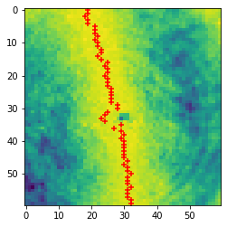


    Stage position:  -0.6 mm


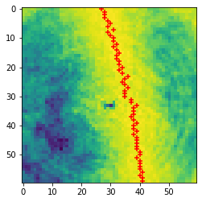


    Stage position:  -0.7 mm


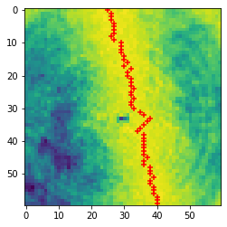


    Stage position:  -0.8 mm


    Stage position:  -0.9 mm


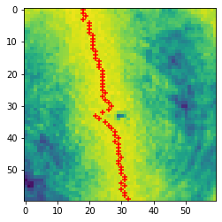


    Stage position:  -1.0 mm


    Stage position:  -1.1 mm


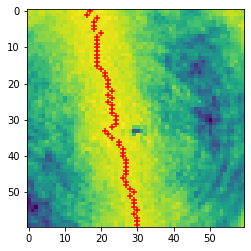


    Stage position:  -1.2 mm


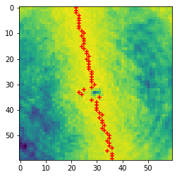


    Stage position:  -1.3 mm


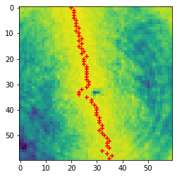


    Stage position:  -1.4 mm


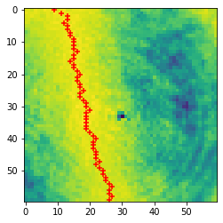


    Stage position:  -1.5 mm


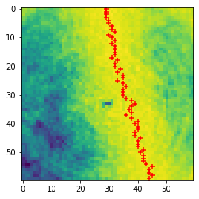


    Stage position:  -1.6 mm


    Stage position:  -1.7 mm


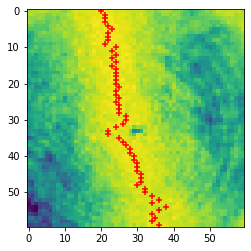


    Stage position:  -1.8 mm


    Stage position:  -1.9 mm


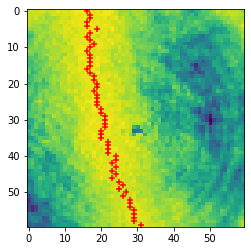


    Stage position:  -2.0 mm


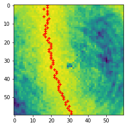


```python
plt.plot(all_curvatures)
plt.xlabel("position,a.u.")
plt.ylabel("curvature,a.u.")
plt.title("Curvature radius of the fringe")
plt.show()
```


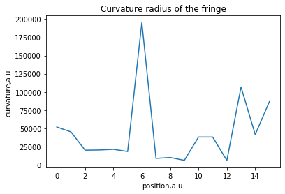


```python
maxpos = 6

print(image_files[maxpos])
```

    /Users/Pavel/Documents/repos/image-processing/misc/curvature-detection/stage_m1p1mm.png


```python
plt.imshow(preprocess(image_files[maxpos]))
plt.show()
```


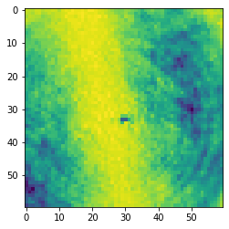


```python

```
